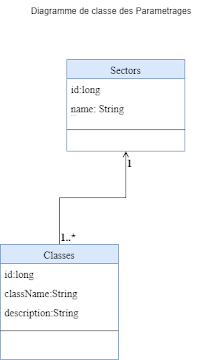

# Projet Maven SOAP Exam

## Prérequis
- **Version Java** : JDK 17
- **Version Tomcat** : Tomcat 10
- **Version Maven** : 3.9.9
- **Docker** : Docker Compose pour la configuration de la base de données

## Architecture

### Modules
1. **Module Metier** :
   - Contient la logique métier et les couches d'accès aux données.
   - **Fichiers** :
     - `dao` et `entity` pour la couche d'accès aux données.
     - `dto`, `mapper`, et `service` pour la couche métier.
   - Localisé dans `metier/src/main/java/com/exam`.

2. **Module Webservices** :
   - Contient l'implémentation des services web SOAP.
   - **Fichiers** :
     - `SectorWebService` et `SectorWebServiceImpl` pour les opérations liées aux secteurs.
     - `ClasseWebService` et `ClasseWebServiceImpl` pour les opérations liées aux classes.
   - Localisé dans `webservices/src/main/java/com/groupeisi/webservice`.

### Couches
1. **Couche Présentation** :
   - Gère l'interaction utilisateur et expose les API.
   - Inclut les services web SOAP dans le module `webservices`.

2. **Couche Métier** :
   - Gère la logique principale et le traitement des données.
   - Implémentée dans le module `metier`.

3. **Couche Accès aux Données** :
   - Gère les interactions avec la base de données.
   - Inclut les classes DAO et entity dans le module `metier`.

## Comment démarrer le projet

### Étapes
1. Cloner le dépôt :
   ```bash
   git clone https://github.com/BADZA99/java-soap-exam.git
   ```
2. Naviguer dans le répertoire du projet :
   ```bash
   cd maven-soap-exam
   ```
3. Construire le projet :
   ```bash
   mvn clean install
   ```
4. Déployer le module `webservices` sur Tomcat 10.
5. Accéder au lien WSDL pour le service web SOAP et tester avec Postman.

### Configuration de la base de données avec Docker
1. Naviguer dans le répertoire `docker` :
   ```bash
   cd docker
   ```
2. Démarrer les services de base de données et phpMyAdmin :
   ```bash
   docker-compose up -d
   ```
3. Accéder à phpMyAdmin via `http://localhost:81`.

## Diagramme de Classe
Le diagramme de classe ci-dessous représente la structure du projet :



## Images
### Tests des services web SOAP
#### Tous les secteurs

#### Obtenir un secteur

#### Sauvegarder un secteur

#### Tous les classes


  ```


